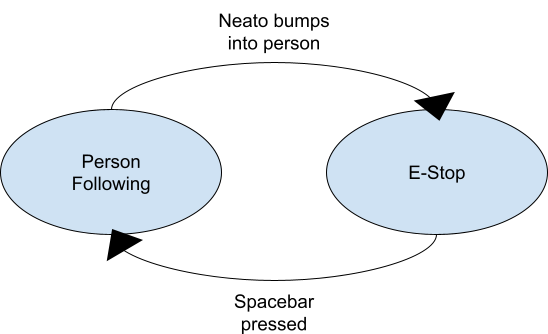

# ROS2 Robot Behaviors Project Report

## Project Overview

The goal of this project is to become more familiar with ROS2. To do so, we created four unique robot behaviors with a finite state machine integrated into one of them. The behaviors we chose were teleop, draw square, wall follow, person follow, and a finite state machine that implements person follow with an e-stop.

## Behaviors

### Teleop Controls

This module allows a person to move the Neato around using the wasd keys on their computer keyboard. To do this, we used the termios python library to retrieve the keys pressed on the keyboard, with these key bindings:

- **"w"**: go forward
- **"s"**: go backwards  
- **"a"**: turn left
- **"d"**: turn right
- **Any other key**: stop moving
- **"ctrl-c"**: stop the program

All movement buttons move the Neato at a linear or angular velocity of 0.2 m/s in their respective directions. The Neato will continue to move in that speed and direction until another key is pressed.

#### Code Structure

To control the Neato's velocity, we publish messages to the "cmd_vel" topic, which the Neato subscribes to. The "cmd_vel" topic uses a "Twist" message type, which includes linear and angular velocities in the x, y, and z directions. For this teleop controller, we only change the linear x velocity and the angular z velocity.

### Move in a Square

The module makes the Neato drive in a square. The robot does this by doing the pattern of driving forward and turning left, repeating this four times to make a square.

#### Code Structure

To control the Neato, we publish Twist messages to the "cmd_vel" (command velocity) topic, which the Neato is subscribed to. This message contains information such as linear and angular velocity. The module moves the Neato in a square shape once going counter-clockwise.

The code is contained in a DrawSquare class with four functions. The turn_left and drive_forward functions utilize the drive function to make the robot turn left by 90 degrees and drive forward for a certain amount. A run_loop function makes the robot run turn_left and drive_forward four times to make the robot drive in a square.

### Wall Following

This module enables the Neato to drive parallel to a wall. When it senses that it is not parallel, it will adjust as it moves.

#### Proportional Control

To follow the wall, this module uses proportional control to adjust the Neato's angle to be parallel to the wall. It follows this equation:

```
v_out = K_p * θ_error
```

where `v_out` is the outputted angular velocity, `K_p` is the proportional gain, and `θ_error` is the difference between the desired angle for the Neato to drive at (which in this case is 0 degrees) and the actual angle the Neato is at relative to the wall.

The following diagram illustrates `θ_error` as well as the Neato frame vs global frame:


**Figure 1.** The global (odom) vs Neato (base link) frames relative to the Neato. `θ_error` is the angular difference between the two frames. The unlabeled black line is the wall, which is parallel to the odom frame.

#### Calculating θ_error

To calculate `θ_error`, we can use the diagram below to derive several equations.


**Figure 2.** Two individual lidar scans from the Neato (shown as dotted black lines) create a triangle with the wall. From the lidar scan, we know the angles `θ_1` and `θ_2`, and we know the distances `a` and `b`.

From Figure 2, we can determine that:

```
θ_error = θ_1 - θ_b  (alternate interior angles theorem)
θ_c = θ_2 - θ_1
```

By the law of cosines:
```
c = sqrt(a^2 + b^2 - 2ab*cos(θ_c))
```

And by the law of sines:
```
θ_b = sin^-1(b/c*sin(θ_c))
```

Combining these, we can determine `θ_error` and plug it into our equation for proportional control.

#### K_p Value

Based on testing, we found that `K_p = 1` was a reasonable value that steered the Neato into place fairly quickly without overcorrecting.

#### Limitations

When using this module the Neato can only follow a wall to its right, and the Neato also cannot identify a wall. It must be placed near a wall without obstructions, and it will follow it. Since this Wall Follower node is only intended to be a demonstration of the wall following behavior, we figured these limitations are acceptable.

#### Alternative Methods

From talking with other teams, it seems that our geometric approach for calculating `θ_error` is more complicated than it has to be. We could have just taken the distances (`a` and `b`) from the two Lidar scans and compared them, turning clockwise or counterclockwise based on which one is larger. We're not sure what an advantage of our more complicated technique would be, but it is cool.

#### Code Structure

The Wall Follower node subscribes to the `/scan` topic (with LaserScan message type), which contains Lidar data from the Neato's onboard Lidar scanner. Each message on `/scan` contains an array of distances corresponding to the distance measurement at each angle from 0° to 360° starting from directly in front of the Neato and going clockwise. From this information, we create a separate angles array with the angle in radians of each point in the scan. Using this data, we have a run_loop function that runs every 0.1 seconds that calculates what speed and direction the Neato should be turning in to keep it moving parallel to the wall. This information is published in a Twist message to the `/cmd_vel` topic.

### Person Following

This module enables the Neato to follow a person while they walk around the room. Through this module, the robot is able to identify where a person is and continuously adjust its angle and speed to maintain following the person.

#### Code Structure

The code follows this high level control loop:

1. Gets scan data through subscription to the `/scan` topic
2. Filters out any scan data that is more than 1.5 meters away
3. Estimates the angle and distance to the person by averaging out the detect LiDar point cluster
4. Computes angular and linear velocity commands through proportional control
5. Publishes velocities to `/cmd_vel` topic to move robot

To filter out noise, the code assumes that whatever object/person the Neato is to follow is within a 1 meter radius of the Neato and is the only thing within that radius.

Below is the class structure of the PersonFollowerNode.

**Class: PersonFollowerNode**

**Attributes:**
- `self._vel_pub`: Publishes velocities to `/cmd_vel`
- `self._distances`: Stores LiDar distances

**Methods:**
- `run_loop()`: Main control loop. Runs at rate of 0.1 seconds
- `process_scan(msg)`: Processes incoming LaserScan messages to be stored in `self._distances`
- `find_person()`: Determines angle and distance between the Neato and whatever object it is trying to follow

**Helper functions:**
- `convert_to_signed_angles`: Converts angles from 0, 360 to -180, 180
- `convert_to_cartesian`: Converts polar coordinates to x and y cartesian coordinates
- `plot_cartesian()`: Plots cartesian (x, y) points in matplotlib for visualization

Below is an explanation for the logic behind `find_person()`.

The `find_person()` method receives the LiDar data in the form of a list where each index corresponds to an angle and each element in that array represents the distance read at that angle.

The data then gets filtered, dropping any distances greater than 1.5 meters. We do this to remove any noise. Below is what the robot sees after this filtering is done. For the purposes of visualization, the polar coordinates have been converted to cartesian.


After filtering, the angles and distances that remain are extracted. To estimate the position of the object to be followed, the angles are converted from 0, 360 to -180, 180. Then, the angles and distances are averaged to get an estimated position. Below the red point shows the estimated position the Neato thinks the object is at. Once again, everything is being shown in cartesian coordinates for the sake of visualization.


The estimated distance and angle position of the object to be followed is then returned by `find_person()`. These values then get used in `run_loop()`. Proportional control values of `Kp_linear` and `Kp_angular` are applied to the values to obtain a linear and angular velocity. These values are then published on `/cmd_vel` for the Neato.

### Finite State Machine

This module is a finite state machine, which combines the person follower node with a stop/continue feature. The Neato will follow a person until it bumps into them, then it will stop. It can be resumed by pressing the spacebar.



**Figure 5.** Finite state machine diagram with two states: person following and e-stop, and the conditions under which they transition to the other state.

#### Code Structure

Both states are run within an FSM node, which has functions for controlling the FSM state, for person following, and for the E-stop.

**Finite State Machine Functions:** The finite state machine is in charge of keeping track of the current active state (person following or e-stop) and running the appropriate functions for the Neato to perform that behavior.

**Person Following Functions:** A reimplementation of the person follower behavior, with the added job of subscribing to the `/bump` topic and switching the state of the finite state machine from person following to e-stop when the bump sensors are activated.

**E-Stop Functions:** Publishes a linear and angular velocity of 0 to the `/cmd_vel` topic so that the Neato does nothing. Also listens for the user to press the spacebar on their keyboard. If they do, the state switches back to person following and the Neato resumes following a person.

## Reflection

### Challenges

**Computational setup can be challenging.** For a good chunk of the project time, one of our team members was experiencing many issues related to computational setup. As a result, they had to go to office hours several times to get everything resolved. Since we properly planned out our deadlines and deliverables early, this setback wasn't too bad. The biggest loss was that this person couldn't help to contribute as much work in the beginning.

**The simulator and the real world are very different.** Something that runs perfectly in the simulation may not work in real life. What we learned was that the simulator is a great tool to use as a sanity check to ensure that the fundamental logic of the code is sound, but we need to allot time for debugging on the physical Neato as well.

### Further Work (How would we improve our project if we had more time)

If we had more time, something we were thinking of doing was incorporating threading into the code. One idea we had in the beginning was using a finite state machine to switch between different robot behaviors. A way we were thinking of doing this was having two threads, one for running the behavior and another listening for a specific input. This way behaviors could be switched even while in the middle of execution.

Another thing we could improve on is making more complex behaviors. It was fun to reason through how we might do the wall and person follower behaviors, and it would be exciting to try a bigger conceptual challenge.

We would also enable the person following behavior to distinguish between a person and other objects—such as another Neato—by identifying the two separate clusters of points representing their footsteps.

### Key Takeaways

**Simpler is better.** The more complex your code is, the more time you will spend debugging, so it's best to go for the simplest option that will do what you want.

**Use visualizations, print statements, and topic echo a lot for debugging.** Being able to see what is happening with your code is really helpful.

**Writing code takes 20% of the time and debugging takes 80%, so allot time for that.**

**Always write documentation and write-up material as you go.** We did a good job of this, and it prevented a crunch at the end of the project because once we finished up the code most of the report was already done.

**Use the resources provided.** They are extremely helpful and make life way easier. There were several times during the project where we were stuck on something for a while, only for one of us to later realize that the Comp Robo website has code for doing that exact thing.

**Schedule meetings liberally and in advance.** We also did a good job of this and had miraculously few scheduling issues. Our philosophy was that it's better to schedule a meeting and cancel it later than not schedule it and realize we need one and then not be able to find a time.
